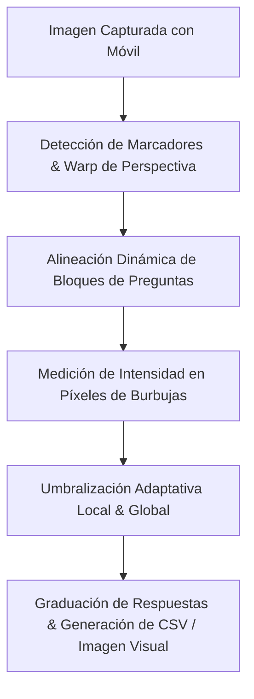

# Documento de Especificaciones Técnicas: Procesamiento OMR y Lectura de Cartillas (Dispositivos Móviles)

Este documento detalla el funcionamiento del motor de reconocimiento óptico de marcas (OMR) del proyecto BackEnd para la lectura de cartillas capturadas con dispositivos móviles (cámaras de celulares). Está estructurado para ser entregado directamente al equipo de **IDE OpenCode** para el diseño e integración de APIs.

---

## 1. Introducción y Arquitectura del Proceso

El motor backend está basado en algoritmos de **Visión Computacional (OpenCV)** para procesar fotos de cartillas de respuestas. Dado que las capturas móviles sufren de rotación, distorsión de perspectiva, escalas variables y sombras, el sistema implementa un flujo robusto en 5 etapas para garantizar una precisión óptima:



---

## 2. Desafíos de la Lectura Móvil y Soluciones Técnicas

Para que el backend sea capaz de leer imágenes capturadas con celulares (las cuales no son perfectas como un escaneo de cama plana), utiliza los siguientes mecanismos:

1. **Corrección de Perspectiva y Distorsión (`CropOnMarkers`):**
   - El sistema detecta 4 marcadores de color negro (generalmente cuadrados o círculos) en las esquinas de la hoja.
   - Divide la imagen en 4 cuadrantes y aplica una plantilla de coincidencia (`cv2.matchTemplate`) a múltiples escalas con respecto a `omr_marker.jpg`.
   - Utiliza las posiciones de los centros de los 4 marcadores detectados para calcular una matriz de homografía y aplicar una **transformación de perspectiva** (`four_point_transform`), devolviendo una cartilla perfectamente rectangular y alineada de tamaño estándar.
2. **Alineación Dinámica (`autoAlign`):**
   - Las imperfecciones en la captura o impresión pueden desplazar las preguntas. El backend realiza un barrido en los límites de cada bloque de preguntas para detectar los márgenes de las cajas y recalcular el desplazamiento horizontal/vertical real (`shift`).
3. **Cálculo Adaptativo de Umbral (Iluminación Variable):**
   - En lugar de usar un valor de negro fijo (lo cual fallaría por sombras o baja exposición), el backend calcula un **Umbral Global** analizando la desviación estándar de las intensidades de todas las burbujas.
   - Luego, calcula un **Umbral Local por fila (strip)**. Si la intensidad media de píxeles dentro de la burbuja es menor que el umbral local (los valores más cercanos a 0 representan negro en escala de grises), la burbuja se marca como rellena.

---

## 3. Clases Principales y su Reseña

A continuación se describen las clases clave del backend involucradas en la lectura de la cartilla:

### 1. `ImageInstanceOps` (`src/core.py`)
- **Reseña:** Es el motor principal de procesamiento de imágenes. Se encarga de instanciar las operaciones de lectura para cada directorio/imagen.
- **Funciones Críticas:**
  - `apply_preprocessors()`: Aplica la secuencia de preprocesadores (como el recorte por marcadores).
  - `read_omr_response()`: El flujo central. Realiza la detección de la alineación, calcula los umbrales adaptativos (local y global), y evalúa qué burbujas están rellenas basándose en la intensidad de píxeles promedio de cada caja.
  - `get_global_threshold()` y `get_local_threshold()`: Métodos estadísticos para hallar los umbrales de decisión entre burbujas marcadas y vacías.

### 2. `CropOnMarkers` (`src/processors/CropOnMarkers.py`)
- **Reseña:** Clase heredada de `ImagePreprocessor`. Su función única es identificar los cuatro marcadores de las esquinas en la foto tomada por el móvil, calcular los centros y enderezar geométricamente la imagen usando la perspectiva correcta.
- **Características:**
  - Configurable a través de ratios de marcadores.
  - Tolerante a variaciones de tamaño de captura gracias al redimensionamiento dinámico del marcador durante la coincidencia de plantillas.

### 3. `Template` (`src/template.py`)
- **Reseña:** Representa la estructura de la cartilla leída desde `template.json`. Analiza las dimensiones de la página, dimensiones de las burbujas individuales, preprocesadores requeridos, y las columnas de respuesta.
- **Propósito:** Actúa como el mapa lógico que le dice al lector de imágenes exactamente en qué coordenadas `(x, y)` buscar cada pregunta y opción.

### 4. `FieldBlock` (`src/template.py`)
- **Reseña:** Estructura que agrupa un conjunto de preguntas u opciones (por ejemplo, columnas de respuestas de la pregunta 1 a la 15). Calcula las dimensiones de los bloques basándose en las brechas entre burbujas (`bubblesGap`) y entre etiquetas (`labelsGap`).

### 5. `Bubble` (`src/template.py`)
- **Reseña:** Objeto de datos que representa una burbuja OMR individual. Almacena su coordenada exacta `(x, y)` mapeada a la plantilla, la etiqueta de la pregunta a la que pertenece (ej. `Q1`) y el valor asignado si se marca (ej. `A`).

### 6. `EvaluationConfig` (`src/evaluation.py`)
- **Reseña:** Clase responsable de parsear las respuestas correctas desde `evaluation.json`. Mapea las preguntas con sus claves de respuestas y define el puntaje a aplicar (esquema de puntuación por defecto o personalizado).

---

## 4. Comandos de Ejecución y Pruebas del Backend

Para ejecutar y probar la lectura de cartillas en el backend, se utilizan los siguientes comandos desde la terminal en el directorio raíz del proyecto:

### Procesamiento Estándar
Procesa una carpeta de imágenes de cartillas que contenga los archivos de configuración (`config.json`, `template.json`, `evaluation.json`, y `omr_marker.jpg`):
```bash
python main.py -i inputs/Imax/evaluacion
```
*(Los resultados se guardarán en la carpeta `outputs/Results/Results_*.csv` y las imágenes con las respuestas visualmente marcadas en `outputs/CheckedOMRs/`)*.

### Configuración del Layout (Visualización de la Rejilla)
Útil para calibrar y asegurarse de que las coordenadas definidas en `template.json` se alineen correctamente sobre las imágenes de la cartilla:
```bash
python main.py -i inputs/Imax/evaluacion --setLayout
```

### Ejecución con Argumentos Adicionales
- **Especificar directorio de salida personalizado (`-o`):**
  ```bash
  python main.py -i inputs/Imax/evaluacion -o outputs_personalizados
  ```
- **Alineación automática experimental (`-a`):**
  ```bash
  python main.py -i inputs/Imax/evaluacion --autoAlign
  ```

---

## 5. Estructura de Archivos de Configuración Requeridos

Cada examen o "lectura de cartilla" móvil requiere los siguientes archivos JSON dentro de su directorio de entrada:

### `template.json` (Ejemplo simplificado de IMAX)
Define el mapa de burbujas en coordenadas de píxeles:
```json
{
  "pageDimensions": [1600, 2300],
  "bubbleDimensions": [43, 43],
  "customLabels": {},
  "fieldBlocks": {
    "C1_G1": {
      "fieldType": "QTYPE_MCQ5",
      "origin": [95, 1223],
      "bubblesGap": 54,
      "labelsGap": 65,
      "bubbleCount": 25,
      "fieldLabels": ["Q1", "Q2", "Q3", "Q4", "Q5"]
    }
  },
  "preProcessors": [
    {
      "name": "CropOnMarkers",
      "options": {
        "relativePath": "omr_marker.jpg",
        "sheetToMarkerWidthRatio": 17
      }
    }
  ]
}
```

### `config.json`
Define configuraciones de comportamiento de salida y dimensiones:
```json
{
    "dimensions": {
        "display_width": 500,
        "display_height": 850,
        "processing_width": 1350,
        "processing_height": 2300
    },
    "outputs": {
        "show_image_level": 0,
        "save_image_level": 5,
        "filter_out_multimarked_files": false
    },
    "alignment_params": {
        "auto_align": true
    }
}
```

### `evaluation.json`
Especifica las respuestas correctas y los criterios de puntuación:
```json
{
    "source_type": "custom",
    "options": {
        "should_explain_scoring": true,
        "questions_in_order": ["Q1", "Q2", "Q3", "Q4", "Q5"],
        "answers_in_order": ["A", "B", "C", "D", "E"]
    },
    "marking_schemes": {
        "DEFAULT": {
            "correct": 1,
            "incorrect": 0,
            "unmarked": 0
        }
    }
}
```

---

## 6. Directrices para el Desarrollo de APIs (IDE OpenCode)

Para exponer este backend como API, se sugieren los siguientes lineamientos:

1. **Framework Recomendado:** **FastAPI** (Python) o **Flask**.
2. **Endpoint Principal (`POST /api/v1/scan`)**:
   - **Request (Multipart/Form-Data):**
     - `file`: Imagen capturada por el móvil (JPEG/PNG).
     - `template_id`: Identificador para seleccionar las configuraciones (`template.json`, `evaluation.json` correspondientes).
   - **Response (JSON):**
     - Retornar un objeto estructurado que contenga:
       ```json
       {
         "status": "success",
         "file_name": "cartilla_mobile_123.jpg",
         "score": 4.5,
         "answers": {
           "Q1": "A",
           "Q2": "B",
           "Q3": "",
           "Q4": "D",
           "Q5": "BCDE"
         },
         "verdicts": {
           "Q1": "Correct",
           "Q2": "Correct",
           "Q3": "Unmarked",
           "Q4": "Incorrect",
           "Q5": "Incorrect"
         }
       }
       ```
3. **Manejo de Errores Críticos:**
   - **Error 422 / Código de Error Interno:** Cuando el preprocesador `CropOnMarkers` no puede detectar los 4 marcadores de la esquina debido a encuadres deficientes, cortes extremos de la imagen o iluminación nula. En la API debe responderse un mensaje amigable: *"No se detectaron las marcas de esquina. Por favor, reencuadre la foto y asegúrese de que se visualicen los 4 extremos de la cartilla."*
